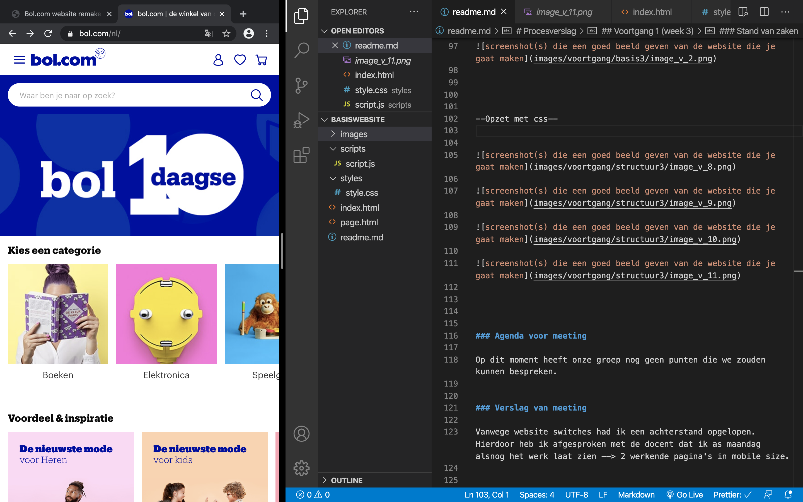

# Procesverslag
**Auteur:** Syarah Dalfour

Markdown cheat cheet: [Hulp bij het schrijven van Markdown](https://github.com/adam-p/markdown-here/wiki/Markdown-Cheatsheet). Nb. de standaardstructuur en de spartaanse opmaak zijn helemaal prima. Het gaat om de inhoud van je procesverslag. Besteedt de tijd voor pracht en praal aan je website.

## Bronnenlijst
1. Alle Images/content --> https://www.bol.com/nl/

2. Main resource voor basis html / css --> https://www.w3schools.com

3. resource 2 voor html / css zijn ook opdrachten van het vak zelf --> https://codepen.io/syarah04/pen/oNxyjjV

4. positioneren van de zoekbutton --> https://www.geeksforgeeks.org/how-to-put-a-responsive-clear-button-inside-html-input-text-field/

5. centreren social media --> https://stackoverflow.com/questions/30473650/how-to-align-a-link-html-css/30473729

## Eindgesrpek HER (week 9/10)

Wat er vooral mis ging was het wijzigen van de content. Alle css staat goed alleen zodra ik een image wilde wijzigen werd de css niet over de nieuwe image gezet. Alle benamingen werden ook aangepast en het zou moeten werken. Dat gebeurde niet --> Veel frustratie

Het positioneren van de resultaten pagina was vrij lastig. Bol.com heeft specifieke plekken voor alle info over het product en in combi met responsivness worden er elementen toegvoegd of verkleind/verwijderd. 

Hier heb ik vooraf naar gevraagd en kreeg als advies alles in blokjes te schetsen en dan te puzzelen emt waar moest. Samen met de opgebouwde kennid van flexbox en positoneren, heeft dat deels geholpen voor op het kleine scherm. 

## Eindgesprek (week 7/8)

Ik heb de opdracht niet kunnen afronden voorgaand het gesprek. Ik had ervoor gekozen om de focus te leggen op de andere vakken. Het eindgesprek werd een feedback gesprek en er was afgesproken om bij de herkansing de eindopdracht te laten zien.

Ik heb veel feedback gekregen en heb een aantal onderdelen moeten aanpassen/toevoegen. 

## Voortgang 3 (week 6)

De week voor de herfst reces.

In deze week was ik aardig opweg. De eerste pagina was afgerond en moest alleen nog responsivne gemaakt worden en iconen switchen. De detail pagina had een goede html en css opzet. Ik hoefde alleen de resultaten informatie goed te positoneren, stylen en vervolgens responsive te maken.

### Agenda voor meeting

-Voortgang laten zien 
-aangeven waar het mis gaat en vragen stellen 

### Verslag van meeting
-carousels laten zien en voortgang van pagina 2

### --VOORTGRANG EINDOPDRACHT--

## Voortgang 2 (week 5)
Deze week lag de focus op de opzet van de detail pagina en voorbereid zijn op de carousel demo van aankomende maandag. Ik was zeker nog niet ver vergeleken met het vorige voortgangsgesprek dus ik heb zoveel mogelijk html toegevoegd aan de detail pagina zodat ik alleen nog met css aan de slag hoefde. 

Dit ging vrij goed. Na het vallen en opstaan met de homepage ging de html bij de detail pagina veel sneller en raakte ik in een goeie flow tijdens het coderen daarvan. 

De home pagina was inmiddels al klaar (behalve responsivness)

### Agenda voor meeting

-Voortgang laten zien 
-vragen stellen over carousels na mislukte poging. 

### Verslag van meeting

-Besproken dat mijn opdracht zich focust op responsivness
-voortgang beide pagina's laten zien 

### --VOORTGRANG EINDOPDRACHT--

### Toevoeging website content

### Opzet pagina 2

## Voortgang 1 (week 3)

### Onderwerp: Flexbox

#### extra oefenen
Deze week heb ik nog wat aandacht besteed aan flexbox. Na de froggy opdracht en de flexbox opdracht heb ik nu een beter beeld van de wat de elemeten die beschikbaar zijn allemaal kunnen en welke problemen ze kunnen oplossen. 

#### wat is nog lastig?
Het enige wat ik nog lastig vind is bepalen wanneer je welk element gebruikt. Veel lijken op elkaar dus dat is soms lastig. Ik heb gemerkt dat blijven experimenteren en zien wat er gebeurt als ik een element gebruik, het beste helpt hierbij.

### Onderwerp: Java script

Voor het begrijpen Java script heb ik de video's meerdere malen bekeken en de opdrachten gemaakt. Hierbij liep ik al snel vast omdat het mij niet lukte oprecht te begrijpen hoe javascript en wat de code doet die erbij hoort. 

#### In de les
Hiervoor heb ik in de les het deel van de opdracht laten zien waar ik vast liep en realiseerde ik em dat ik goed opweg was, alleen vanwege niet goed de logica van javascript te snappen was ik een deel vergeten. (ervoor zorgen dat er iets gebeurt nadat de button klikbaar is) Met hulp van medestudenten heb ik dit kunnen oplossen

#### final thoughts
Na de javascript demo in de les kon ik eindelijk zeggen dat ik de basics van javascript begreep. Het implementeren in mijn eindopdracht word de volgende uitdaging.

#### website switch

Toch nog geswitched van website. Ik heb nu als eindkeuze bol.com vanwege de balans tussen content, complexe onderdelen en simpel design.

## Voortgang Eindopdracht

De basis html voor de eerste pagina was gemaakt. Vervolgends heb ik de css toevoegd om het meer op de huisstijl van bol.com te laten lijken. Hier ging het vooral de juiste content erin zetten en netjes maken. Positionering en flexbox heb ik vaak gebruikt hiervoor om alles op de juiste plek te kunnen zetten. Na veel oefenen is dat best goed gegaan en kan er met meer vertrouwen mee werken. 

Met css ging eht vooral om de juiste taal te spreken. Ik merkte vooral met de tekst aanpassen dat er een groot verschil is tussen het element font en text.

### origineel

### mijn eerste opzet

### Opzet met css

### Agenda voor meeting

Op dit moment heeft onze groep nog geen punten die we zouden kunnen bespreken. 

### Verslag van meeting

Vanwege website switches had ik een achterstand opgelopen. Hierdoor heb ik afgesproken met de docent dat ik as maandag alsnog het werk laat zien --> 2 werkende pagina's in mobile size.

## (week 2)

### Onderwerp: positionering

Deze week hebben we geleerd over positionering. De opdrachtne hebben heel erg geholpen met het begrijpen en kunnen coderen met de elementen die heirbij horen.

In de les zijnd eopdrachten besproken en was er nog ruimte voor vragen.

### Overig

Ik heb besloten te switchen van website aangezien de content die hoort bij de notion website wat lastiger word om zelf na te maken. Voornamelijk de demo-video's. 

## Intake (week 1)

Deze week bestond vooral uit het introduceren van het vak, de opdracht en planning. Daarnaast ook het kiezen van een website en hiervan breakdown schetsen te maken. Mijn keuze ging uit naar de Notion website vanwege het minimalistische design en de verwerking van video / visual. Dit wilde ik graag leren om te maken. 

**Je startniveau:**  blauwepiste

**Je focus:** surface

**Je opdracht:** https://www.bol.com/nl/

**Screenshot(s):**

**Breakdown-schets(en):**

