# Procesverslag
**Auteur:** Syarah Dalfour

Markdown cheat cheet: [Hulp bij het schrijven van Markdown](https://github.com/adam-p/markdown-here/wiki/Markdown-Cheatsheet). Nb. de standaardstructuur en de spartaanse opmaak zijn helemaal prima. Het gaat om de inhoud van je procesverslag. Besteedt de tijd voor pracht en praal aan je website.

## Bronnenlijst
1. Webiste iconen --> https://www.w3schools.com/icons/icons_reference.asp + https://cdnjs.cloudflare.com/ajax/libs/font-awesome/4.7.0/css/font-awesome.min.css

2. Alle Images/content --> https://www.bol.com/nl/

3. Main resource voor basis html / css --> https://www.w3schools.com

4. resource 2 voor html / css zijn ook opdrachten van het vak zelf --> https://codepen.io/syarah04/pen/oNxyjjV

5. positioneren van de zoekbutton --> https://www.geeksforgeeks.org/how-to-put-a-responsive-clear-button-inside-html-input-text-field/

6. centreren social media --> https://stackoverflow.com/questions/30473650/how-to-align-a-link-html-css/30473729

## Eindgesprek (week 7/8)

-dit ging goed & dit was lastig-

**Screenshot(s):**

-screenshot(s) van je eindresultaat-

## Voortgang 3 (week 6)

-same as voortgang 1-

## Voortgang 2 (week 5)

-same as voortgang 1-

## Voortgang 1 (week 3)

### Stand van zaken

--VOORTGRANG EINDOPDRACHT--

Bol.com kleuren

MAin blauw: 2b378b
licht blauw: cce3f5

--Onderwerp: Flexbox--

-extra oefenen-
Deze week heb ik nog wat aandacht besteed aan flexbox. Na de froggy opdracht en de flexbox opdracht heb ik nu een beter beeld van de wat de elemeten die beschikbaar zijn allemaal kunnen en welke problemen ze kunnen oplossen. 

-wat is nog lastig?-
Het enige wat ik nog lastig vind is bepalen wanneer je welk element gebruikt. Veel lijken op elkaar dus dat is soms lastig. Ik heb gemerkt dat blijven experimenteren en zien wat er gebeurt als ik een element gebruik, het beste helpt hierbij.

--Onderwerp: Java script--

Voor het begrijpen Java script heb ik de video's meerdere malen bekeken en de opdrachten gemaakt. Hierbij liep ik al snel vast omdat het mij niet lukte oprecht te begrijpen hoe javascript en wat de code doet die erbij hoort. 

-In de les-
Hiervoor heb ik in de les het deel van de opdracht laten zien waar ik vast liep en realiseerde ik em dat ik goed opweg was, alleen vanwege niet goed de logica van javascript te snappen was ik een deel vergeten. (ervoor zorgen dat er iets gebeurt nadat de button klikbaar is) Met hulp van medestudenten heb ik dit kunnen oplossen

-final thoughts- 
Na de javascript demo in de les kon ik eindelijk zeggen dat ik de basics van javascript begreep. Het implementeren in mijn eindopdracht word de volgende uitdaging.

--website switch--

Toch nog geswitched van website. Ik heb nu als eindkeuze bol.com vanwege de balans tussen content, complexe onderdelen en simpel design.

**Screenshot(s):**

-screenshot(s) van hoe ver je bent-

-Voortgang eindopdracht basis html structuur / css -

--origineel--
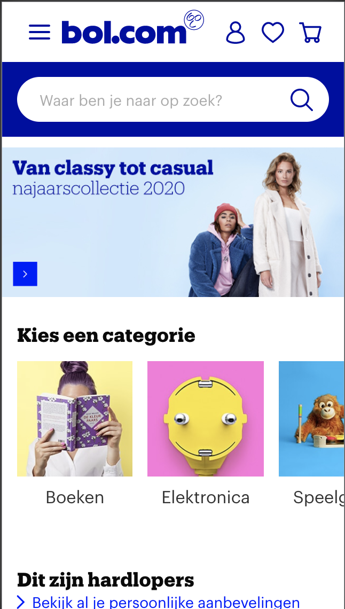

--mijn eerste opzet--

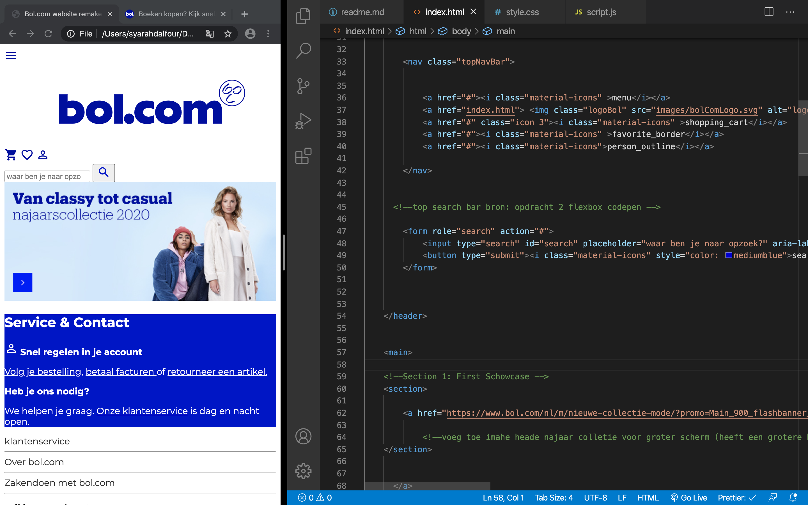

--Opzet met css--
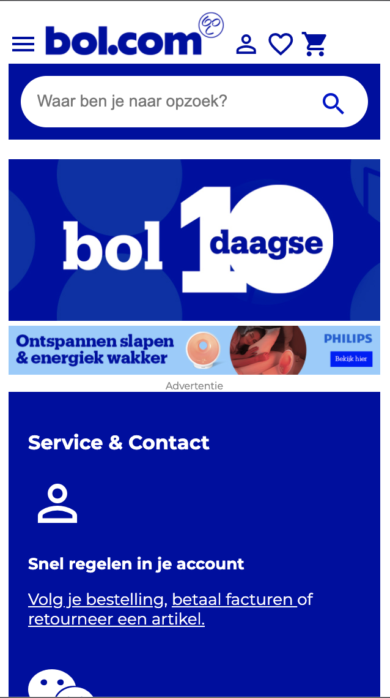

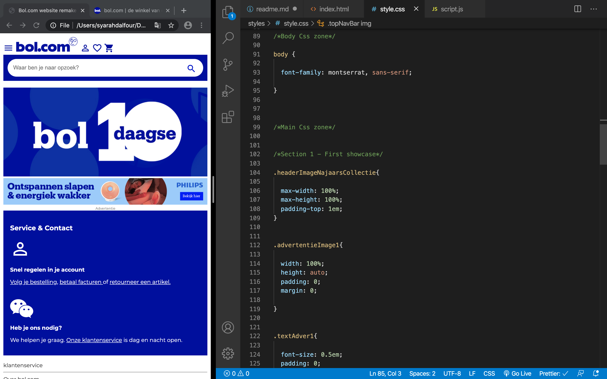

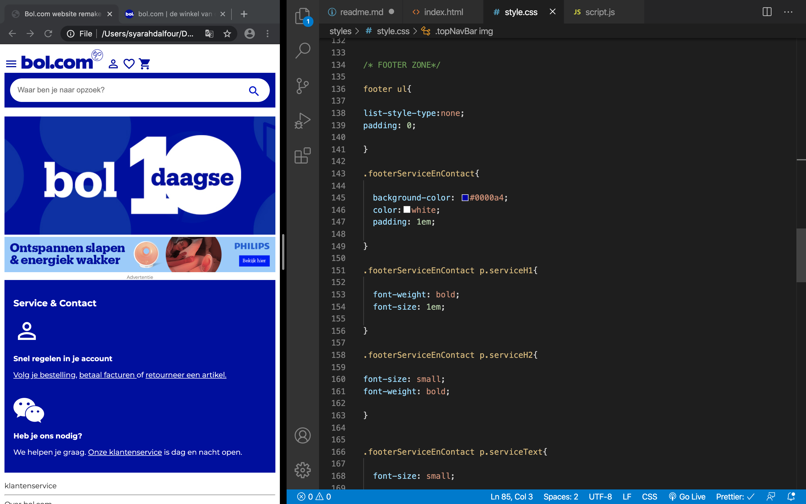

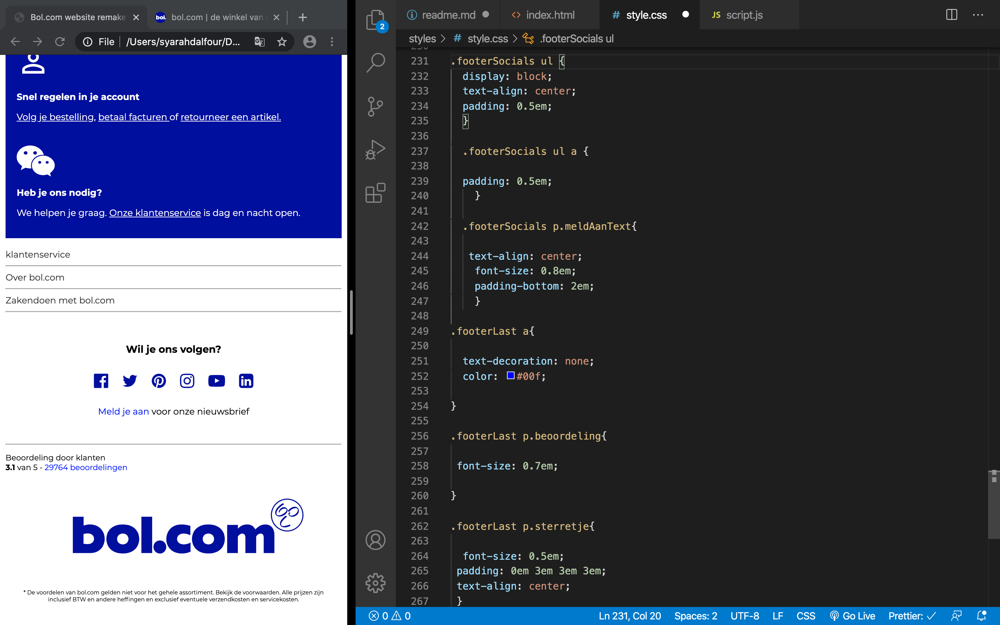

### Agenda voor meeting

Op dit moment heeft onze groep nog geen punten die we zouden kunnen bespreken. 

### Verslag van meeting

Vanwege website switches had ik een achterstand opgelopen. Hierdoor heb ik afgesproken met de docent dat ik as maandag alsnog het werk laat zien --> 2 werkende pagina's in mobile size.

## (week 2)

--Onderwerp: positionering--

(beschrijf proces)

--Overig--

Ik heb besloten te switchen van website aangezien de content die hoort bij de notion website wat lastiger word om zelf na te maken. Voornamelijk de demo-video's. 

## Intake (week 1)

Deze week bestond vooral uit het introduceren van het vak, de opdracht en planning. Daarnaast ook het kiezen van een website en hiervan breakdown schetsen te maken. Mijn keuze ging uit naar de Notion website vanwege het minimalistische design en de verwerking van video / visual. Dit wilde ik graag leren om te maken. 

**Je startniveau:**  blauwepiste

**Je focus:** surface

**Je opdracht:** https://www.bol.com/nl/

**Screenshot(s):**

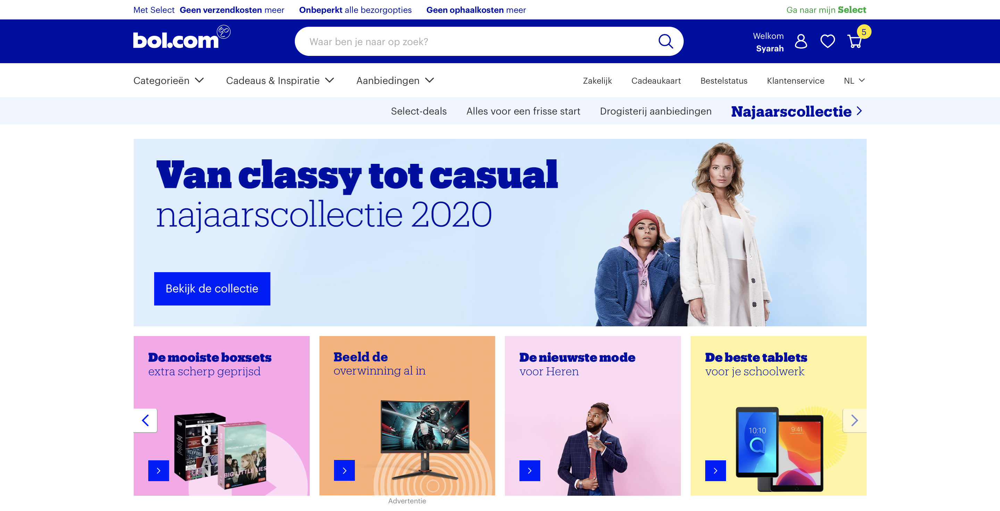

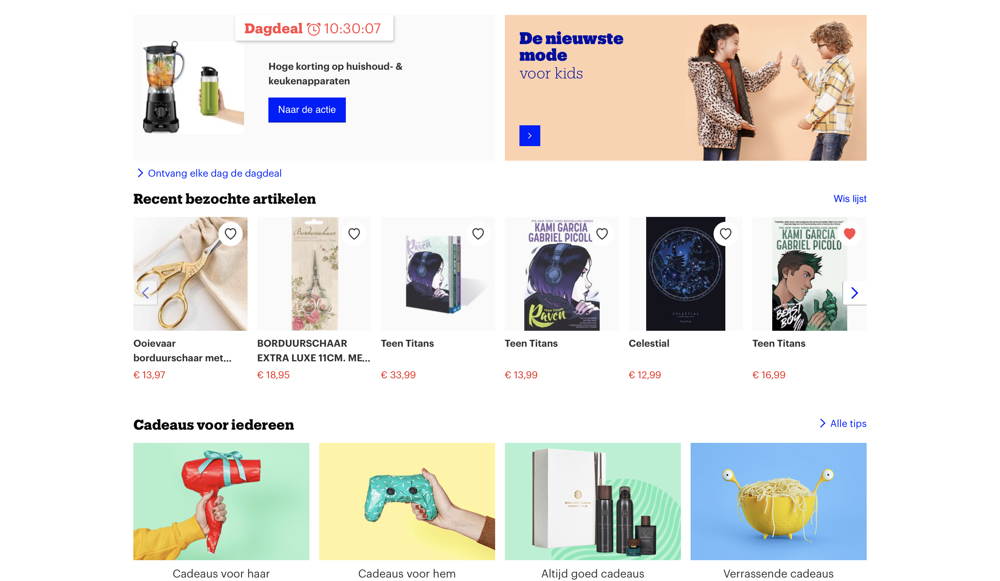

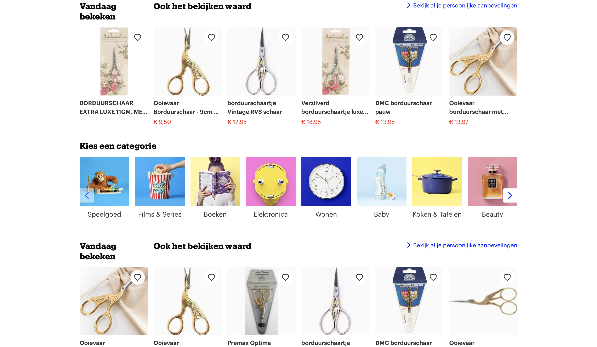

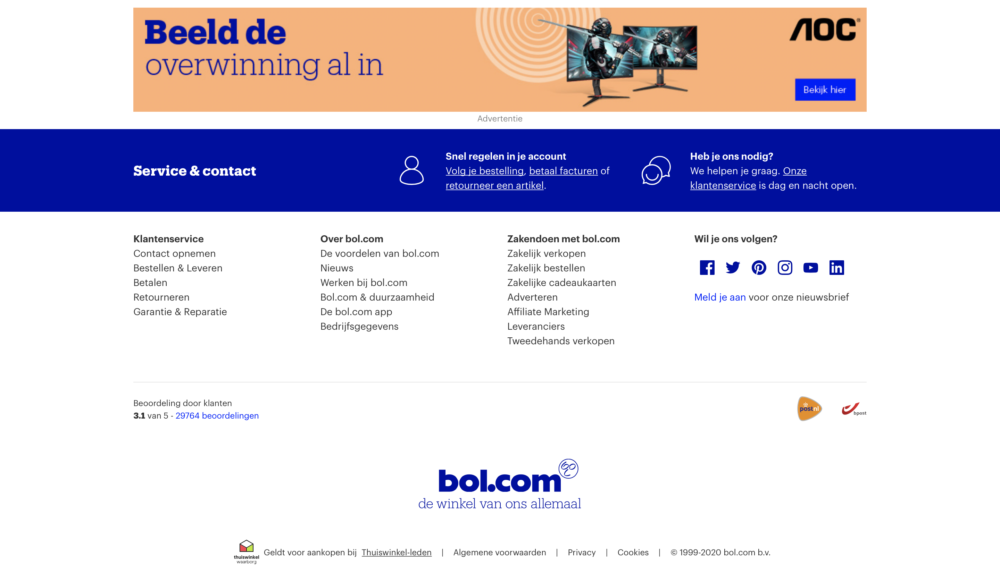

**Breakdown-schets(en):**

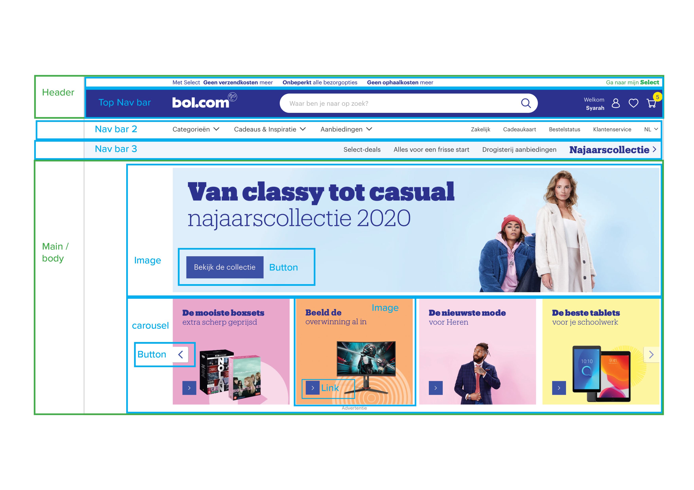

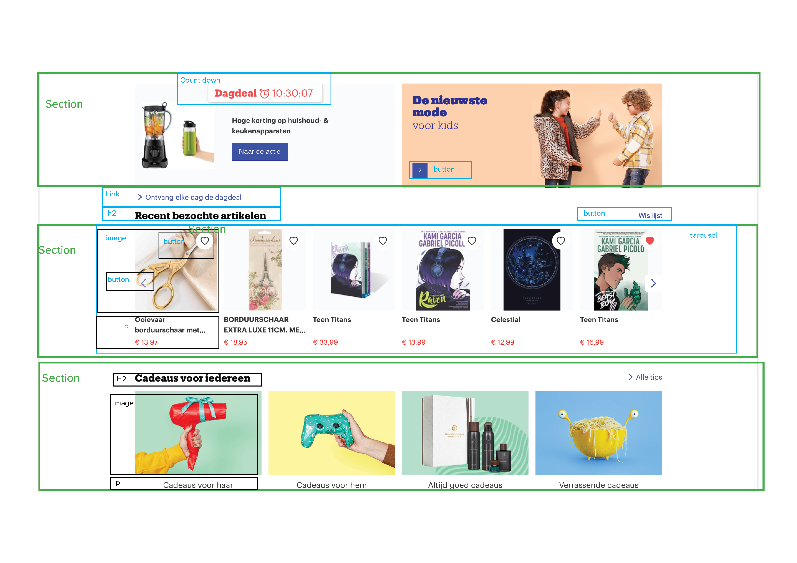

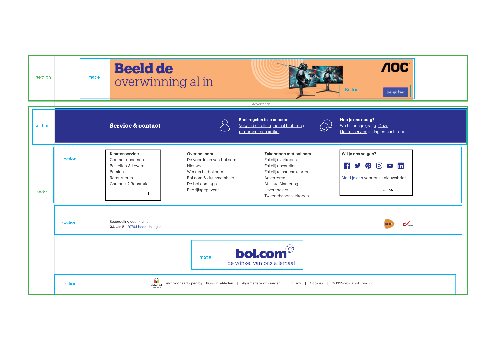